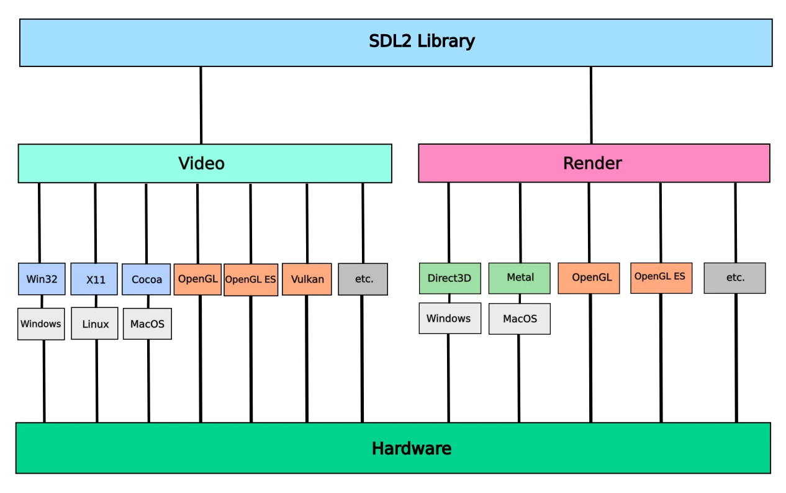

# SDL2 Graphics Stack
The graphics stack of SDL2.

## Render drivers
**SDL_render.h** is for 2D accelerated rendering.

List of drivers that the render portion of SDL2 supports.
- Windows
	- Direct 3D
		- D3D_RenderDriver
		- D3D11_RenderDriver
		- D3D12_RenderDriver
- Apple devices (iOS, IPadOS, macOS, and tvOS)
	- Metal
		- METAL_RenderDriver,
- Khronos Group
	- OpenGL
		- GL_RenderDriver
	- OpenGL ES
		- GLES2_RenderDriver
		- GLES_RenderDriver
- Sony
	- PS2
	    - PS2_RenderDriver,
	- PSP
		 - PSP_RenderDriver
	- VITA
		- VITA_GXM_RenderDriver
- Software Rendering
	- SW_RenderDriver
- Unix like
	- Direct FrameBuffer
		- DirectFB_RenderDriver

## Video drivers
**SDL_video.h** is for display and window management.

List of drivers that the video portion of SDL2 supports.
- Windows
	- Windows API (Win32)
		- WINDOWS_bootstrap
	- Windows Runtime (WinRT)
		- WINRT_bootstrap
- Linux
	- Display managers
		- X11
			- X11_bootstrap
		- Wayland
			- Wayland_bootstrap
		- Direct Rendering Mananager Kernel Mode Setting (KMS/DRM) 
			- KMSDRM_bootstrap
			- KMSDRM_LEGACY_bootstrap
- MacOS
	- Cocoa
		- COCOA_bootstrap
- Kkronos Group
	- Vulkan
		- vulkan_config
	- EGL (OpenGL, OpenGL ES and OpenVG)
		- egl_data
        - Mesa implements the EGL API
	- OpenGL ES and OpenGL ES2
		- gles_data
- Apple Devices (iOS, iPadOS, and tvOS)
	- UIKIT_bootstrap 
- Sony
	- PS2
		- PS2_bootstrap
	- PSP
		- PSP_bootstrap
	- PlayStation Vita
		- VITA_bootstrap
- Android
	- Android_bootstrap 
- Raspberry pi
	- RPI_bootstrap 
- Nintendo 3DS
	- N3DS_bootstrap
- N-Gage
	- NGAGE_bootstrap
- Haiku
	- HAIKU_bootstrap
- RISC OS
	- RISCOS_bootstrap
- QNX (commercial Unix-like OS)
	- QNX_bootstrap
- IBM (OS/2)
	- OS2DIVE_bootstrap
	- OS2VMAN_bootstrap
- Webassembly
	- Emscripten_bootstrap
- Pandora
	- PND_bootstrap
- NaCL (discontinued)
    - NACL_bootstrap
- Vivante GPU (Acquired by VeriSilicon Holdings Co., Ltd.)
    - VIVANTE_bootstrap
- Misc:
	- OFFSCREEN_bootstrap
	- DUMMY_bootstrap
	- DUMMY_evdev_bootstrap

## Resources
### SDL2 Source Code
**Render Source Code**
- [https://github.com/libsdl-org/SDL/blob/SDL2/include/SDL_render.h](https://github.com/libsdl-org/SDL/blob/SDL2/include/SDL_render.h)
- [https://github.com/libsdl-org/SDL/blob/SDL2/src/render/SDL_render.c](https://github.com/libsdl-org/SDL/blob/SDL2/src/render/SDL_render.c)
- [https://github.com/libsdl-org/SDL/blob/SDL2/src/render/SDL_sysrender.h](https://github.com/libsdl-org/SDL/blob/SDL2/src/render/SDL_sysrender.h)

**Video Source Code**
- [https://github.com/libsdl-org/SDL/blob/SDL2/include/SDL_video.h](https://github.com/libsdl-org/SDL/blob/SDL2/include/SDL_video.h)
- [https://github.com/libsdl-org/SDL/blob/SDL2/src/video/SDL_video.c](https://github.com/libsdl-org/SDL/blob/SDL2/src/video/SDL_video.c)
- [https://github.com/libsdl-org/SDL/blob/SDL2/src/video/SDL_sysvideo.h](https://github.com/libsdl-org/SDL/blob/SDL2/src/video/SDL_sysvideo.h)

**Vulkan Source Code**
- [https://github.com/libsdl-org/SDL/blob/SDL2/include/SDL_vulkan.h](https://github.com/libsdl-org/SDL/blob/SDL2/include/SDL_vulkan.h)
- [https://github.com/libsdl-org/SDL/blob/SDL2/src/video/SDL_vulkan_internal.h](https://github.com/libsdl-org/SDL/blob/SDL2/src/video/SDL_vulkan_internal.h)
- [https://github.com/libsdl-org/SDL/blob/SDL2/src/video/SDL_vulkan_utils.c](https://github.com/libsdl-org/SDL/blob/SDL2/src/video/SDL_vulkan_utils.c)

### FAQ: Using SDL
- [https://wiki.libsdl.org/SDL2/FAQUsingSDL](https://wiki.libsdl.org/SDL2/FAQUsingSDL)

### Pandora
- [https://openpandora.org/](https://openpandora.org/)

### NaCL (discontinued)
- [https://en.wikipedia.org/wiki/Google_Native_Client](https://en.wikipedia.org/wiki/Google_Native_Client)

### Vivante Corporation
- [https://en.wikipedia.org/wiki/Vivante_Corporation](https://en.wikipedia.org/wiki/Vivante_Corporation)
- [https://verisilicon.com/en/IPPortfolio/VivanteGPUIP](https://verisilicon.com/en/IPPortfolio/VivanteGPUIP)

### EGL
- [https://en.wikipedia.org/wiki/EGL_(API)](https://en.wikipedia.org/wiki/EGL_(API))

### Mesa
- [https://en.wikipedia.org/wiki/Mesa_(computer_graphics)](https://en.wikipedia.org/wiki/Mesa_(computer_graphics))

